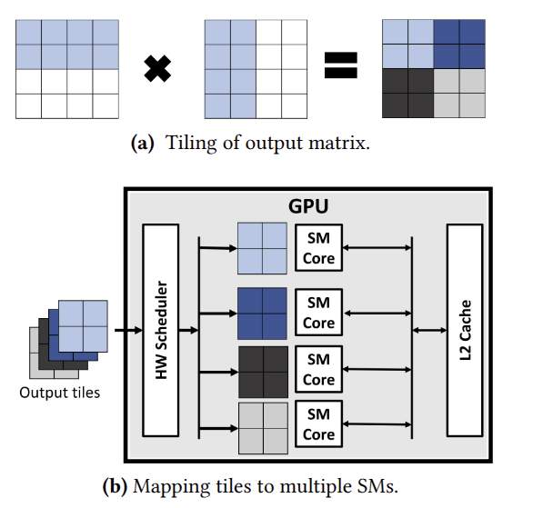
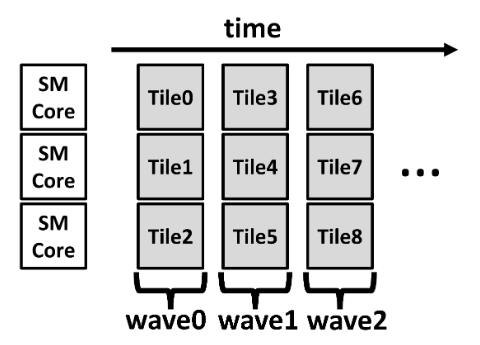
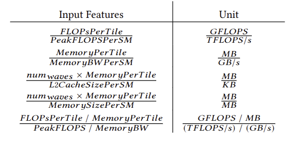
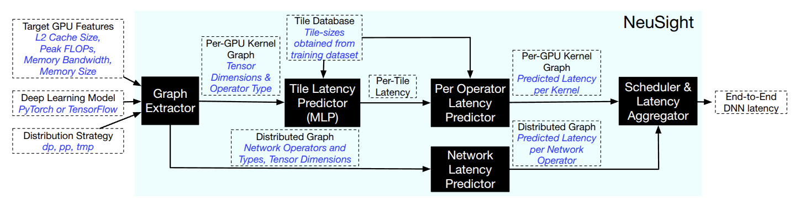

# Forecasting GPU Performance for Deep Learning Training and Inference

**Задача:** спрогнозировать производительность при обучении или инференсе модели на GPU.

**Идея:** Для уменьшение ошибки предсказание делится на несколько мелких этапов, при этом предсказание происходит при помощи алгоритмов машинного обучения.

## NeuSight forecasting

NeuSight прогнозирует задержку выполнения модели на нескольких GPU сервера в три этапа:
 1) (основной шаг) прогнозирует задержку одного ядра, которое выполняется на GPU атомарно.
    Ядро использует программную и аппаратную оптимизацию для GPU, а именно тайлирование, параллельное выполнение через SM, встроенное кэширование и пропускную способность HBM. NeuSight использует архитектурные детали, такие как размер памяти, пропускная способность памяти, количество SM, размер кэша L2 и пиковые значения FLOPS, для прогнозирования задержки ядра с помощью ML. Наша оценка ядра основана на том, как DNN ядра разбираются на несколько более мелких фрагментов и отображаются на аппаратном обеспечении GPU для выполнения. 
 2) Задержка каждого оператора агрегируется для прогнозирования производительности рабочей нагрузки DNN на основе графа потока данных. 
 3) Производительность выполнения на каждом GPUобъединяется с прогнозируемыми задержками в сети для определения производительности DNN,выполняемой на нескольких GPU.

### Kernel Execution on GPUs

#### Tiled Execution

Для примера возьмем GeMM.

На рисунке выше показано упрощенное представление типичного потока данных GeMM на GPU.

Современные библиотеки GPU выполняют GEMM, сначала разделяя выходную матрицу на несколько одинаковых фрагментов (а). Каждая плитка соответствует сегменту выходной матрицы, загружает необходимые входные операнды из входных матриц и вычисляет выходные элементы. Эти тайлы сопоставляются с каждым SM и выполняются одновременно (b). Обычно количество тайлов, которые могут выполняться одновременно, ограничено количеством SM на GPU, а все ядро ​GPU выполняется в нескольких волнах групп тайлов, как показано на рисунке ниже. Стратегия тайлов обеспечивает масштабируемое выполнение GEMM путем разложения GEMM на несколько меньших рабочих нагрузок, которые выполняют идентичные вычисления на разных входных и выходных элементах.

**Пояснение:** По сути режем матрицы, в каждый SM отправляем данные, необходимые для вычисления одного тайла. Внутри SM уже вычисляются тайлы. Затем они собираются в матрицу. Потоки нужны, чтобы считать тайлы по группам

#### Fundamental performance laws of GPUs

Время выполнения каждого ядра (kernel) ограничивается несколькими характеристиками GPU, такими как пиковая пропускная способность памяти или пиковая вычислительная производительность (FLOPs). Roofline-анализ предоставляет простой метод оценки приближённой производительности GPU-ядра с учётом арифметической интенсивности этого ядра. Интенсивность вычисляется как отношение количества операций с плавающей точкой $(flops_k)$ к объёму операций с памятью $(mem_k)$. Пропускная способность в модели Roofline может быть вычислена следующим образом:

$$
K = \frac{flops_k}{mem_k} \\
roofline_{BW} = \min(K \times memBW_p, flops_p) \  (1)
$$

Где: $flops_p$ - пиковое количество flops. $memBW_p$ - пиковая пропускная способность памяти GPU

#### Latency hiding in GPU

Хотя пропускная способность линии крыши представляет собой теоретическую максимальную пропускную способность, каждое ядро ​​не всегда полностью использует доступную пропускную способность вычислений или памяти. 

Еще одним ограничением производительности при выполнении на GPU является использование нескольких потоков для обеспечения параллелизма, что обеспечивает значительно более высокую пропускную способность по сравнению с традиционными архитектурами CPU. GPU могут достичь вышеупомянутой пиковой аппаратной производительности $(𝑟𝑜𝑜 𝑓 𝑙𝑖𝑛𝑒_{𝐵𝑊} )$ только тогда, когда имеется достаточно доступных программных потоков для эффективного уменьшения задержек, возникающих из-за зависимости данных или задержек памяти, путем планирования независимых потоков. Следовательно, производительность GPU во многом зависит от уровня параллелизма в ядрах, который прямо пропорционален количеству потоков, которые могут быть независимо запланированы в каждом SM.

### Kernel-wise Prediction

#### Tile-granularity prediction

Для каждого ядра DNN мы разбиваем его на несколько одинаковых фрагментов вместо того, чтобы напрямую прогнозировать задержку ядра. Таким образом, мы используем модель машинного обучения, чтобы сделать прогноз для каждого фрагмента и собрать эти прогнозы, чтобы определить задержку всего оператора. Такая декомпозиция упрощает задачу на более управляемые подзадачи, позволяя обучать модель машинного обучения решению более мелких и простых задач. Например, типичные размеры плиток, используемые библиотекой GEMM, варьируются от 32 до 256, что все же намного меньше размеров GEMM в современных рабочих нагрузках DNN. Чтобы вычислить задержку всего ядра на основе прогнозов для каждого тайла, мы используем следующее:

$$
num_{tiles} = \prod_{i=1}^{N} \frac{x_i}{t_i} \ (2) \\
num_{waves} = \frac{num_{tiles}}{num_{sm}} \ (3) \\ 
PerOpLatency = PerTileLatency \times num_{waves} \ (4)
$$

Переменные $x_i$ и $t_i$ — это размеры выходных данных и тайла соответственно, $N$ — количество измерений выхода, а $num_{sm}$ — количество SM-блоков, доступных в GPU. Размеры тайла определяются метаданными, полученными с помощью PyTorch Profiler. В формуле выше мы предполагаем, что каждый SM выполняет по одному тайлу за раз. Задержка ядра обычно линейно масштабируется с количеством волн тайлов и может моделироваться как последовательное выполнение волн тайлов. Поскольку GPU могут выполнять потоки из нескольких тайлов одновременно, такое перекрытие учитывается и абстрагируется в формуле (7) (ниже). 

#### Imposing performance laws to tile prediction

$PerTileLatency$ зависит от загрузки вычислительных блоков SM и достигнутой пропускной способности ядра ($achievedBW$), и физически ограничена $roofline_{bw}$. Эта зависимость описывается следующими уравнениями:

$$
PerTileLatency = \frac{flop_{tile}}{achievedBW} \ (5) \\
achievedBW = roofline_{bw} \times utilization \ (6)
$$

Далее нам нужно предсказать загрузку GPU. Мы используем наблюдение, что GPU приближается к максимальной достижимой пропускной способности по мере увеличения количества доступных потоков в нагрузке. Мы формулируем корреляцию между количеством волн (потоков) и загрузкой при помощи модели машинного обучения. Это связано с тем, что ML-модель может улавливать нелинейное поведение между задержкой ядра и характеристиками GPU, а также свойствами ядра, такими как тип оператора, размеры тайла и арифметическая интенсивность. Мы поручаем MLP-моделям предсказывать коэффициенты следующей формулы:

$$
utilization = alpha - \frac{beta}{num_{waves}} \ (7) \\
alpha, beta = \sigma(MLP(input\_features)) \ (8)
$$

Это формулв моделирует загрузку, которая растёт с увеличением количества волн из-за отрицательного коэффициента $beta$, но ограничена сверху значением $alpha$. Мы применяем сигмоидную функцию к выходам MLP, чтобы ограничить предсказанное значение загрузки значением ниже 1. Такой подход заставляет прогнозы соблюдать фундаментальные законы производительности, усиливая их общую предсказательную способность даже при работе с незнакомыми входными данными.

### Machine Learning Model to Predict Utilization

В качестве предсказателя используется MLP с несколькими полносвязными слоями. обучается пять различных MLP, каждый из которых предназначен для пакетного умножения матриц, полносвязных слоев, поэлементных операторов, softmax и нормализации слоев.

#### Model architecture

Каждая MLP состоит из 8 скрытых слоёв, каждый из которых содержит 512 скрытых нейронов. Первый слой преобразует входные векторы признаков в 512-мерный скрытый вектор, а последний слой преобразует этот 512-мерный вектор в одномерный выход. В качестве функции активации используется ReLU, которая применяется в конце каждого слоя. Такая простая и компактная архитектура позволяет быстро и при этом точно делать прогнозы, особенно в сочетании с потоком выполнения на GPU и законами масштабирования производительности в рамках NEUSIGHT.

Мы используем размер памяти, пропускную способность, пиковую производительность FLOPS и размер кэша L2 в качестве характеристик GPU для моделирования. Мы выбираем эти признаки по следующим причинам:  
 1. они публично доступны даже для новых GPU;  
 2. пропускная способность и пиковая производительность FLOPS определяют границы производительности для операций, ограниченных вводом-выводом и вычислениями;  
 3. размер встроенной памяти (L2-кэш) и внешней памяти (например, High Bandwidth Memory или DRAM) определяют, какая реализация будет использоваться библиотеками, такими как cuDNN и CUTLASS, для выполнения операторов DNN.  

Вместо того чтобы подавать эти входные признаки напрямую в MLP, мы предварительно обрабатываем их следующим образом. Во-первых, поскольку мы делаем прогнозы на уровне тайла, причём каждый тайл отображается на один SM, мы делим ресурсы устройства на количество SM, чтобы определить ресурсы на один SM (например, пиковую производительность FLOPS на SM). Во-вторых, поскольку MLP предсказывает достижимую пропускную способность, мы подаём ей загрузку каждого аппаратного ресурса. Ниже представлена таблица со всеми входными данными:

## NeuSight Workflow

На рисунке ниже показан общий рабочий процесс NeuSight. Он берет описание целевой модели глубокого обучения в PyTorch и извлекает граф оператора/ядра с помощью библиотеки Torch.fx. Он записывает метаданные каждого ядра, включая тип оператора и размеры тензора ввода/вывода. На основе метаданных и размера плитки каждый оператор помечается прогнозами, сделанными нашим предсказателем уровня ядра. Задержка для каждого GPU вычисляется путем суммирования прогнозируемой задержки каждого ядра, выполняющегося на одном устройстве, что соответствует выполнению устройства, где ядра выполняются последовательно на GPU.

NeuSight также принимает в качестве входных данных стратегию распределения, ширину параллельности данных, глубину и расписание параллельности конвейера или ширину параллельности тензорной модели.

### Forecasting for Distributed Execution

NeuSight поддерживает выполнение одного сервера с несколькими GPY, аналогично тем, которые подключаются через конфигурации NVLink или DGX Box. Для каждой формы параллелизма NeuSight добавляет в граф DNN соответствующие сетевые операторы. Конвейерный параллелизм включает отправку и получение активаций между GPU на последующих этапах конвейера, в то время как data и tensor параллелизм моделей выполняют все операции сокращения над градиентами и активациями соответственно.

#### Pipeline parallel

Параллельный конвейер требует чередования микропакетов прямого и обратного прохода для достижения высокой загрузки. Для NeuSight пользователь предоставляет параллельное расписание конвейера, а платформа объединяет выполнение на различных устройствах, чтобы определить общую задержку выполнения модели на сервере. В настоящее время NeuSight вставляет необходимые пузыри конвейера между прямым и обратным проходом на основе расписания GPipe, однако его можно легко расширить на другие расписания. NeuSight оценивает задержку этих пузырей конвейера на основе размера микропакета, количества GPU и задержки операций отправки и получения.

#### Data and Tensor parallel

NeuSight вставляет все операторы сокращения в граф DNN для синхронизации активаций (при параллельной модели тензора) или градиентов (при параллельной работе с данными) между GPU. В настоящее время фреймворк поддерживает стратегию тензорной модели Megatron. Задержка кольцевого all-reduce оценивается и суммируется с задержкой вычислений ядер для определения сквозной задержки.

##### Как оценивается задержа all-reduce?

NeuSight оценивает задержку allreduce на основе кольца и одноранговой отправки/получения на основе пропускной способности сетевого канала. Мы измеряем пропускную способность существующей системы и рассчитываем использование ее сетевых каналов. Используя эти данные, а также пиковую пропускную способность канала целевой системы, мы оцениваем задержку коллективных операторов целевой системы. 