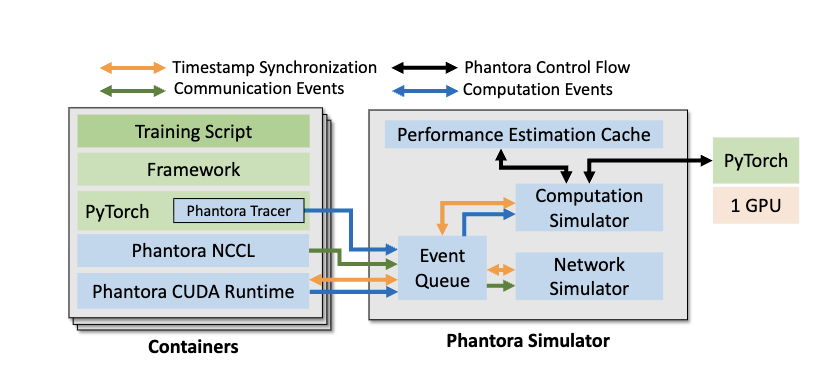
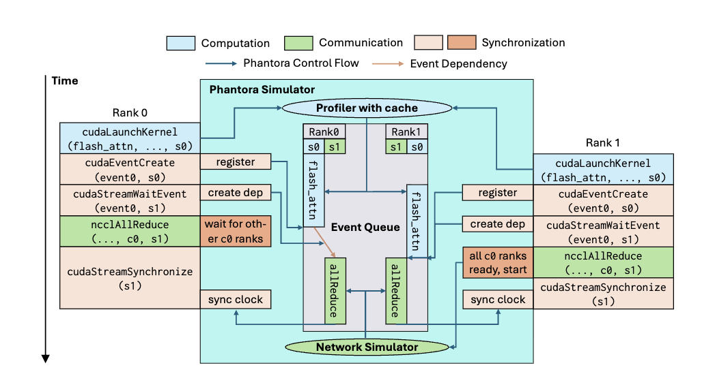
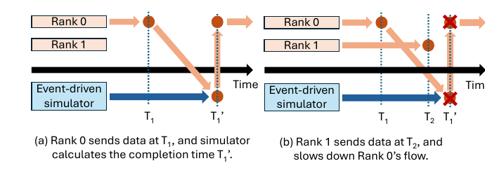

# Phantora: Maximizing Code Reuse in Simulation-based Machine Learning System Performance Estimation

**Идея:** создать симулятор, для запуска в котором не нужно модифицировать исходный код модели. Для этого перехватываются низкоуровневые операции (CUDA, NCCL), а время их выполнения предсказывается.

## Overview

Чтобы поддерживать немодифицированные ML-фреймворки, Phantora запускает фреймворк в реалистичной контейнерной среде и взаимодействует с этой реальной системой при симуляции. На рисунке ниже показана архитектура Phantora. Каждый контейнер играет роль GPU-сервера, в каждом контейнере работают интерпретаторы Python, выполняющие код ML-фреймворка. Взаимодействие контейнеров с симулятором Phantora требуется для двух видов операций: (1) вычислений на GPU и (2) коммуникаций. Когда запускается вычислительное ядро, Phantora профилирует время его выполнения на одной GPU. Для коммуникаций Phantora оценивает время завершения с помощью событийно-ориентированного сетевого симулятора уровня потоков (flow-level). Phantora достаточно одной GPU, поскольку производительность профилируется один раз для каждой комбинации (вычислительное ядро, формы тензоров). Этого достаточно, так как производительность ядра обычно не зависит от значений тензоров¹. Поэтому приложение не может отличить, работает ли оно на Phantora или на физическом GPU-кластере, пока его поток управления не зависит от значений тензоров (в Phantora они мусорные). Время каждого ранга в каждом контейнере Phantora ведёт с помощью стандартной дискретно-событийной симуляции, и приложение может считывать это время для расчёта своей производительности. Наивная реализация такого подхода всё равно потребовала бы менять исходный код ML-фреймворка: например, реализацию таймера, который используется при логировании. Чтобы поддерживать фреймворки «из коробки», Phantora вместо этого использует runtime-патчинг Python: зависимости фреймворка подменяются динамически, во время выполнения.

¹ Есть исключения, например сортировка, где ветвления зависят от результатов сравнений.

## Details of Phantora

### Supporting Unmodified ML Frameworks

Каждый ранг выполняет немодифицированный код ML-фреймворка с использованием библиотек PyTorch и NCCL и взаимодействует со средой выполнения CUDA (CUDA Runtime). В PyTorch встроен Phantora Tracer. Он собирает все вызванные операторы PyTorch и параметры, влияющие на производительность, и передаёт их как вычислительные события в очередь событий симулятора Phantora. Трассировщик не влияет на выполнение PyTorch: операторы по-прежнему отправляются в соответствующий CUDA-бэкенд. Родная среда выполнения CUDA заменена на Phantora CUDA Runtime, которая не выполняет никаких вызовов CUDA, а только хранит метаданные, нужные для эмуляции её поведения (например, `cudaMalloc`/`cudaFree` не выделяют память, а лишь учитывают её использование). Кроме того, она отправляет вызовы CUDA как события в очередь симулятора. Аналогично родная библиотека NCCL заменена на Phantora NCCL: она не выполняет передачу данных, а перенаправляет все коммуникационные операции (например, allreduce) в симулятор, помещая коммуникационные события в очередь. Кроме того, Phantora поддерживает граф зависимостей событий, чтобы эмулировать асинхронную семантику CUDA: CPU запускает вычислительные и коммуникационные ядра и задаёт зависимости между ними через CUDA-потоки (streams) и CUDA-события (events).

На рисунке ниже показан пример работы Phantora с двумя рангами. Оба ранга вычисляют attention, а затем выполняют all-reduce результата. Запуск FlashAttention перехватывается Phantora CUDA Runtime и передаётся в симулятор Phantora. Операторы PyTorch, отслеженные Phantora Tracer, тоже передаются в симулятор как вычислительные события. Затем симулятор вызывает настоящие вычислительные библиотеки, чтобы профилировать эти ядра. Профилировщик хранит в кэше оценок производительности результаты операторов, которые уже были реально выполнены, и при повторном вызове тех же операторов (с теми же формами входов) Phantora берёт результат из кэша. В этом примере FlashAttention ранга 1 не профилируется повторно: симулятор использует кэшированный результат FlashAttention ранга 0.

Phantora NCCL перехватывает коммуникационные операции и передаёт их в симулятор Phantora. Например, на рисунке выше `ncclAllReduce` первым вызывает ранг 0. Этот API неблокирующий, поэтому Phantora NCCL возвращает управление сразу после отправки вызова в симулятор, но симулятор не запускает сетевые потоки, пока не будут готовы все ранги того же коммуникатора (в примере он ждёт, пока ранг 1 вызовет `ncclAllReduce` с `c0`), что соответствует семантике NCCL. Для моделирования времени коллективных операций Phantora использует стандартный flow-level сетевой симулятор, адаптированный из [NetHint](https://hongzhangblaze.github.io/assets/pdf/nethint.pdf) и называемый netsim. Он принимает на вход топологию кластера, а пропускную способность потоков в каждый момент вычисляет по принципу max-min fairness. Коллективные операции представлены как наборы потоков: например, allreduce моделируется кольцевым алгоритмом. Синхронизация задаётся вызовами вроде `cudaStreamSynchronize`: симулятор обрабатывает предшествующие события и возвращает время завершения, по которому обновляются виртуальные часы ранга.

У некоторых фреймворков есть ненастраиваемое поведение, которое не удовлетворяет допущениям Phantora. Чтобы не менять код фреймворка и сохранить привычный пользовательский опыт, Phantora использует динамические возможности Python и подменяет отдельные функции во время выполнения. Например, встроенное логирование производительности в TorchTitan использует `time.perf_counter`, который нужно заменить таймером Phantora. Благодаря runtime-патчингу Phantora может напрямую работать с ML-фреймворками, установленными через `pip install`.

### Loose Time Synchronization of Real Execution and Event-Driven Simulation

Phantora должна правильно синхронизировать реальное выполнение и событийно-ориентированный симулятор, иначе сквозная симуляция будет неточной: события, порождённые реальным выполнением, могут влиять на симулятор. Без надлежащей синхронизации это влияние может быть проигнорировано или учтено неправильно.

#### Time rollback

**Зачем нужен.** Ранги — реальные процессы, работающие с разной скоростью, поэтому события приходят в симулятор в порядке реального времени, а не виртуального. В статических симуляторах все события известны заранее, а Phantora не знает, отправит ли реальный ранг событие и когда. Для вычислений это не проблема: время ядра берётся из кэша и не зависит от других событий. Для сети — проблема: канал общий, и время передачи зависит от всех потоков, которые идут одновременно. На рисунке ниже ранг 0 начинает передачу в T₁, и симулятор вычисляет время завершения T₁′, зная только этот поток. Затем приходит передача ранга 1 с T₂ < T₁′. Она делит канал с потоком ранга 0, и прогноз T₁′ становится неверным.

Синхронизировать симулятор и реальное выполнение малыми квантами времени (как в симуляторах железа) слишком медленно. Ключевое наблюдение авторов: длительность операции не влияет на поток управления реальной системы (ранг вызовет тот же следующий оператор, сколько бы ни длился предыдущий). Поэтому симулятор может отвечать оптимистично, а при приходе события из прошлого откатиться и исправить времена, не перезапуская реальный код.

**Как работает.** Сетевой симулятор хранит историю пропускной способности всех потоков. Между соседними событиями скорости потоков постоянны, поэтому состояние сети S(T₂) восстанавливается из S(T₁) и этой истории. При приходе события в T₂ симулятор откатывается к T₂, пересчитывает скорости затронутых потоков и возвращает их новые времена завершения. Затем очередь событий обновляет по графу зависимостей времена начала и завершения всех событий, которые зависели от изменённых. Меняются только временные метки, реальный код не перезапускается. Прошлых событий конечное число, поэтому и откатов конечное число, и прогресс гарантирован.

**Сборка мусора.** Для отката нужно хранить исторические состояния (граф зависимостей и состояния потоков), что расходует память хоста. Когда все ранги прошли момент T, событие раньше T прийти уже не может, поэтому всё состояние до T удаляется.

**Сетевой симулятор с откатом.** Распределение полосы по max-min fairness вычисляется итеративным алгоритмом water-filling. Для отката добавлены два API: изменить время начала существующего потока и продвинуть симуляцию на шаг или до заданного момента. История потока — несколько чисел с плавающей точкой, а пересчёт при откате инкрементальный, поэтому накладные расходы малы.

### Improving Phantora’s Scalability

В Phantora используются два приёма для масштабируемой симуляции.

**Приём №1: общие параметры модели в памяти CPU.** ML-системы могут инициализировать модели в памяти CPU: случайно или из предобученных весов на диске. После инициализации модели переносятся на GPU. В реальных GPU-кластерах этот этап обычно не узкое место, поскольку объём памяти GPU, как правило, меньше объёма памяти CPU. Но когда Phantora симулирует большой кластер на ограниченных ресурсах, пиковое потребление памяти становится ограничением масштабируемости. Поэтому Phantora позволяет параметрам модели на одном сервере симуляции прозрачно отображаться в одну и ту же область общей памяти, так что на каждом сервере инициализируется не больше одной копии модели. Phantora предполагает, что поток управления ML-системы не зависит от значений тензоров, поэтому параметры можно безопасно разделять, не влияя на выполнение.

**Приём №2: процессорное время вместо системного.** Как и память, CPU тоже может стать узким местом. ML-системы обучения обычно многопроцессные. Если ядер CPU меньше, чем запущенных процессов, переподписка (oversubscription) замедляет ML-систему и вносит неточности в результаты симуляции. Поэтому Phantora учитывает только фактическое процессорное время каждого процесса, а не прошедшее системное время (wall clock). Симуляция при этом всё равно замедляется, но точность результатов не страдает. Phantora также можно настроить так, чтобы процессорное время игнорировалось полностью и в результатах оставались только время работы GPU и время ожидания синхронизации CUDA.

## Выводы:

#### Плюсы:

1. Работает практически с любым фреймворком на PyTorch, потому что перехватывает операторы PyTorch и вызовы CUDA/NCCL. Условие — поток управления не должен зависеть от значений тензоров.
2. Интересные идеи для ускорения симуляции: кэш замеров по паре (оператор, формы тензоров), нестрогая синхронизация с откатом, разделение параметров, учёт процессорного времени. Их можно переосмыслить и использовать. Для MoE нужно учесть, что формы меняются от шага к шагу, поэтому кэш будет промахиваться чаще.
3. Использует сетевой симулятор netsim. Про него можно почитать и попробовать внедрить.

#### Минусы:

1. Не работает с MoE: поддерживается только равномерная нагрузка экспертов. Способы добавить неравномерную есть, но с ними тоже не всё гладко.
2. Мой симулятор должен легко расширяться для проверки гипотез. Гипотезы, которые целиком реализуются в коде модели, Phantora проверит без изменений. А вот для гипотез, которые затрагивают то, что моделирует сама Phantora, придётся менять ядро симулятора.
3. Ядро написано на Rust, поэтому сложнее разобраться, как оно работает, и вносить изменения.
Главная проблема — независимость от данных. Она состоит из двух допущений:
время оператора не зависит от значений. Это нарушается не только в MoE: например, время torch.scatter и torch.gather зависит от распределения индексов;
4. поток управления и формы тензоров не зависят от значений. Для MoE это критично: число токенов на эксперта определяет формы тензоров.

**Вывод:** у Phantora есть очень интересные идеи для адаптации, но как основа она нам не очень подходит, в основном из-за минусов 2 и 4.